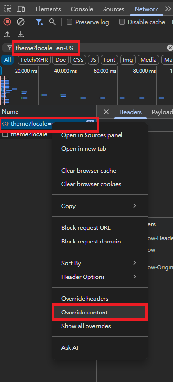
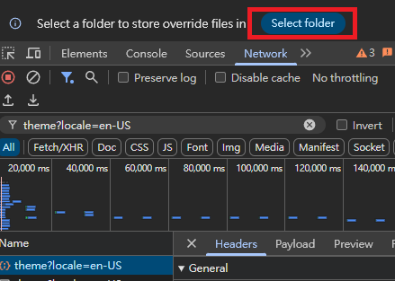
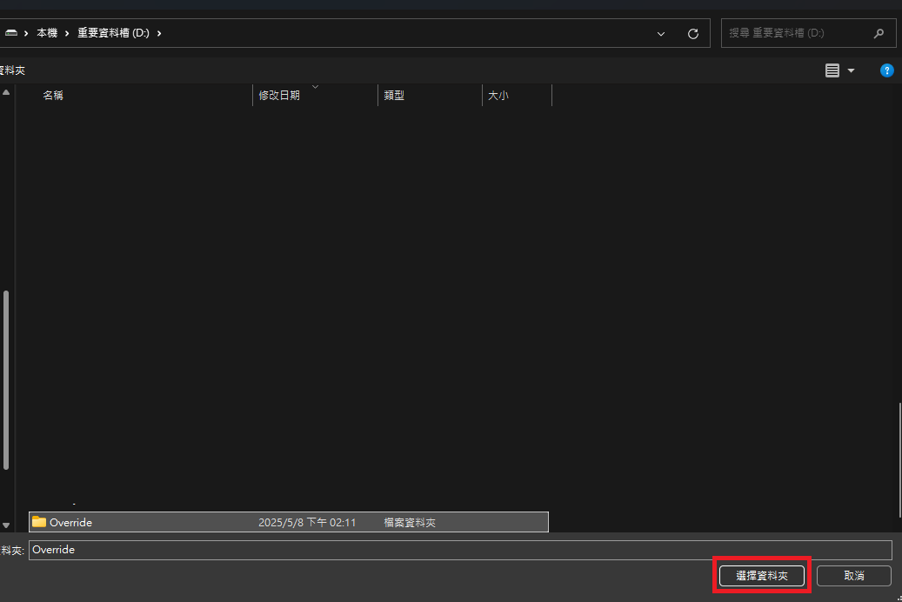
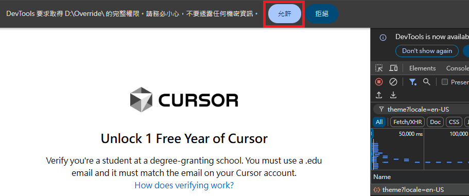
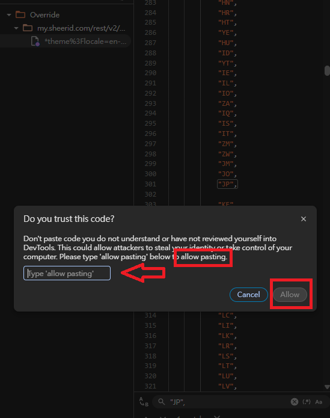
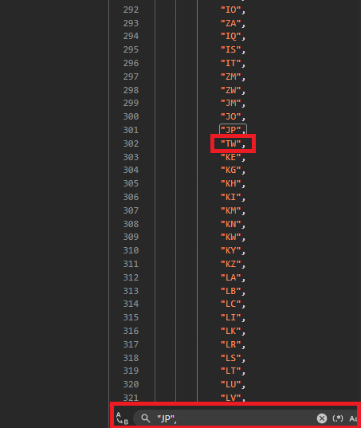
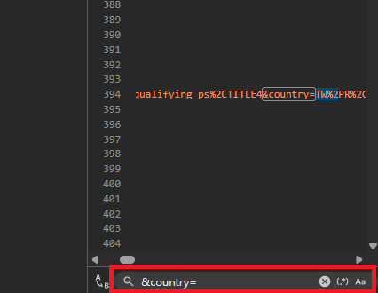
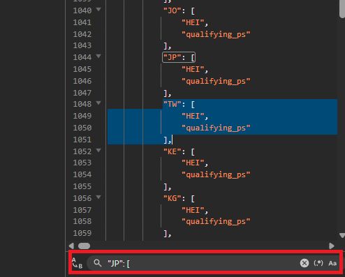
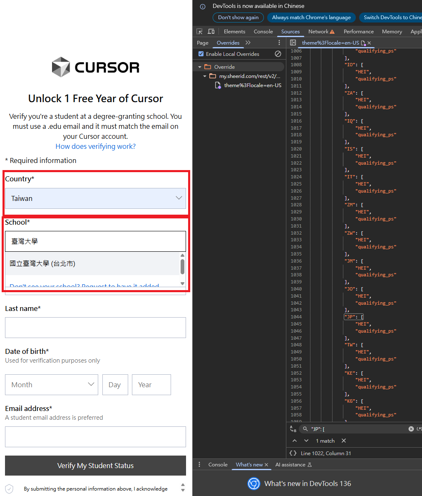

# 🐳【SheerID 台灣插入懶人包教學】v2025.05

讓 Cursor 或其他 SheerID 頁面支援「台灣」，並開啟學校選單！此教學改編自原作者 [@nachokuro](https://www.threads.com/@nachokuro/post/DJYS_BGyoTO?xmt=AQF0iT5FX2nWXu9Ke18fXYs1b5RNnyvtjXmxtKv34Yd9hw) 的出色工作，特此致謝！

---

## 🎯 教學目標

- ✅ 顯示「台灣」選項於國家欄位
- ✅ 學校欄位變為可輸入（解除 disabled）
- ✅ 無需擴充程式，只用 Chrome 開發工具即可達成

---

## 📘 步驟一：打開 DevTools 並尋找可修改的 JSON 回應

🔹 開啟 Cursor 驗證頁面  
🔹 按下 `F12` → 點 `Network`  
🔹 按 `F5` 重新載入頁面  
🔹 搜尋 `theme?locale=en-US`，你會看到兩筆 request  



---

## 🟡 步驟二：啟用 Local Overrides 功能

🔹 點選右鍵 → `Override content`  
🔹 第一次使用會出現提示，點 `Select folder`  



🔹 建議創建 `D:\Override` 等資料夾作為儲存位置  
🔹 點「選擇資料夾」後，按「允許」存取  




---

## 🧩 步驟三：開始修改回應 JSON

🔹 點開左側的 `theme%3Flocale=en-US`  
🔹 DevTools 下方會打開 Response 編輯器  
🔹 按 `Ctrl + F`，依據 JSON 修補三大重點搜尋關鍵字貼上修改後的 JSON，若出現 `allow pasting` 提示，輸入 `allow pasting`  

---

## 🛠 JSON 修補三大重點

🔍 ① config.countries[] 加上 台灣  
按 `Ctrl + F`，搜尋關鍵字:  
`"JP",`  
修改範例:  
```json
"JP",
"TW",
"KE",
```
  

🔍 ② config.orgSearchUrl 中加入 TW  
按 `Ctrl + F`，搜尋關鍵字:  
`&country=`  
修改前:  
```perl
&country=PR%2CPS%2CPT%2CPW%2C...
```
修改後（TW%2C加在最前面）:  
```perl
&country=TW%2CPR%2CPS%2CPT%2CPW%2C...
```
📘 小知識: %2C 是逗號 , 的網址編碼格式  
 

🔍 ③ config.orgSearchCountryTags 加入 台灣  
按 `Ctrl + F`，搜尋關鍵字:  
`"JP": [`  
插入範例:  
```json
"TW": [
  "HEI",
  "qualifying_ps"
],
```
  


---

## ✅ 最終結果示意

貼上正確後，按 `Ctrl + S` 儲存，再 `F5` 重新整理頁面：  
- 「台灣」出現在下拉選單  
- 學校欄位解鎖，可選「國立台灣大學」  



---

## 🧠 小提醒

- `Ctrl + S` 儲存無提示，但會生效  
- 無法貼上時，輸入 `allow pasting` 解除限制  
- 還原時，刪除對應 override 檔案即可  

---

## 📝 免責聲明

此教學僅供學習與測試用途，請勿用於非法目的。使用時請確保遵守相關法律與服務條款。

---

## 🙏 特別感謝

感謝原作者 [@nachokuro](https://www.threads.com/@nachokuro/post/DJYS_BGyoTO?xmt=AQF0iT5FX2nWXu9Ke18fXYs1b5RNnyvtjXmxtKv34Yd9hw) 提供原始教學靈感，讓此懶人包得以誕生！

---

## 📄 許可協議

本教學以 [MIT License](https://opensource.org/licenses/MIT) 開源，歡迎自由分享與修改，但請保留原作者與本教學出處。
